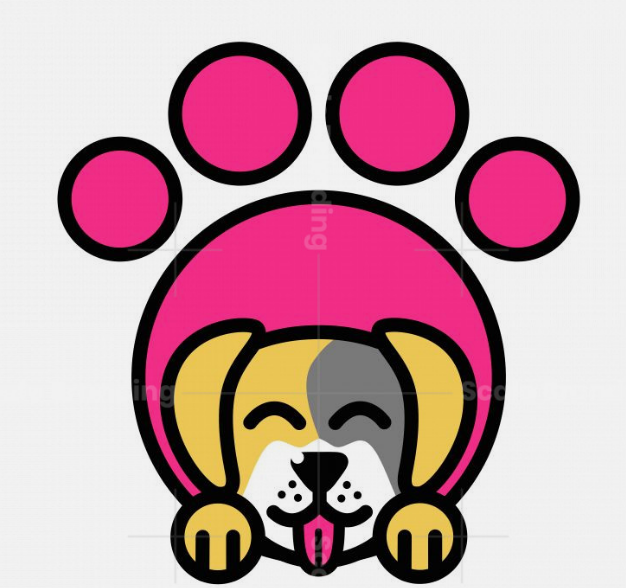
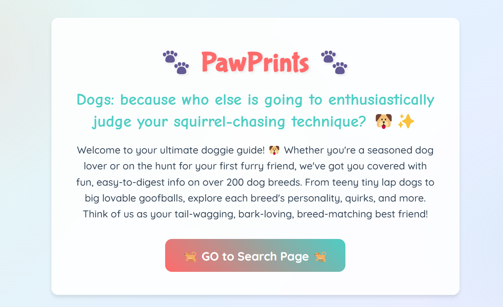
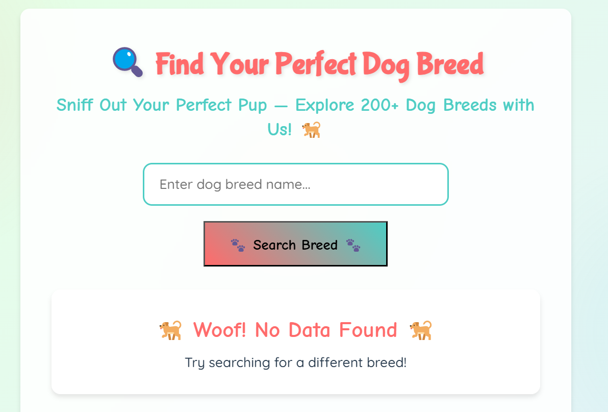
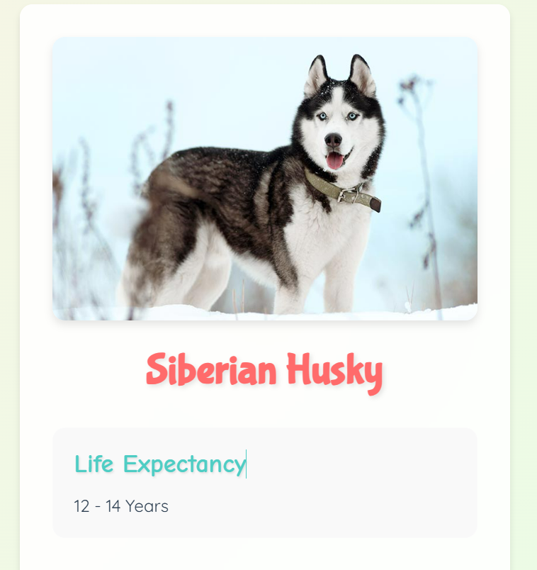

# 🐾 PawPrints - Your Ultimate Dog Breed Guide

PawPrints is a modern, responsive web application that helps dog lovers explore and learn about different dog breeds. With a beautiful UI and comprehensive breed information, PawPrints makes it easy to find your perfect furry companion.

## 🌟 Features

- *Breed Search*: Search through 200+ dog breeds
- *Detailed Information*: View comprehensive details about each breed
- *Responsive Design*: Works seamlessly on desktop, tablet, and mobile devices
- *Beautiful UI*: Modern, playful design with smooth animations
- *User-Friendly*: Intuitive interface with clear navigation

## 🛠 Tech Stack

- *Frontend Framework*: React.js
- *Routing*: React Router v6
- *Styling*: CSS3 with custom animations
- *API Integration*: Axios for API calls
- *Build Tool*: Vite
- *Environment Variables*: dotenv for API key management

## 📸 Screenshots

### Home Page

### Search Page

### Dog Details

## 🚀 Getting Started

### Prerequisites

- Node.js (v14 or higher)
- npm or yarn
- API key from [API Ninjas](https://api-ninjas.com/)

### Installation

1. Clone the repository
bash
git clone https://github.com/yourusername/pawprints.git
cd pawprints

2. Install dependencies
bash
npm install
# or
yarn install

3. Create a .env file in the root directory

VITE_API_NINJAS_KEY=your_api_key_here

4. Start the development server
bash
npm run dev
# or
yarn dev

5. Open your browser and navigate to http://localhost:5173

## 💻 Usage

1. *Home Page*: Click the "GO to Search Page" button to start exploring breeds
2. *Search Page*: Enter a dog breed name in the search box and click "Search Breed"
3. *Results*: View the breed information and click on the card to see more details
4. *Details Page*: Explore comprehensive information about the breed including:
   - Life expectancy
   - Personality traits
   - Behavior characteristics
   - Compatibility with other dogs, children, and strangers

## 🔑 API Key Setup

1. Sign up at [API Ninjas](https://api-ninjas.com/)
2. Get your API key from the dashboard
3. Create a .env file in the project root
4. Add your API key: VITE_API_NINJAS_KEY=your_api_key_here

## 📱 Responsive Design

PawPrints is fully responsive and works on:
- Desktop computers
- Tablets
- Mobile phones
- Different screen orientations

## 🙏 Acknowledgments

- [API Ninjas](https://api-ninjas.com/) for providing the dog breed data
- [Google Fonts](https://fonts.google.com/) for the beautiful typography
- All the dog lovers who inspired this project

## 📞 Contact

For any questions or suggestions, please open an issue in the GitHub repository.

---

Made with ❤ by Manasvi
